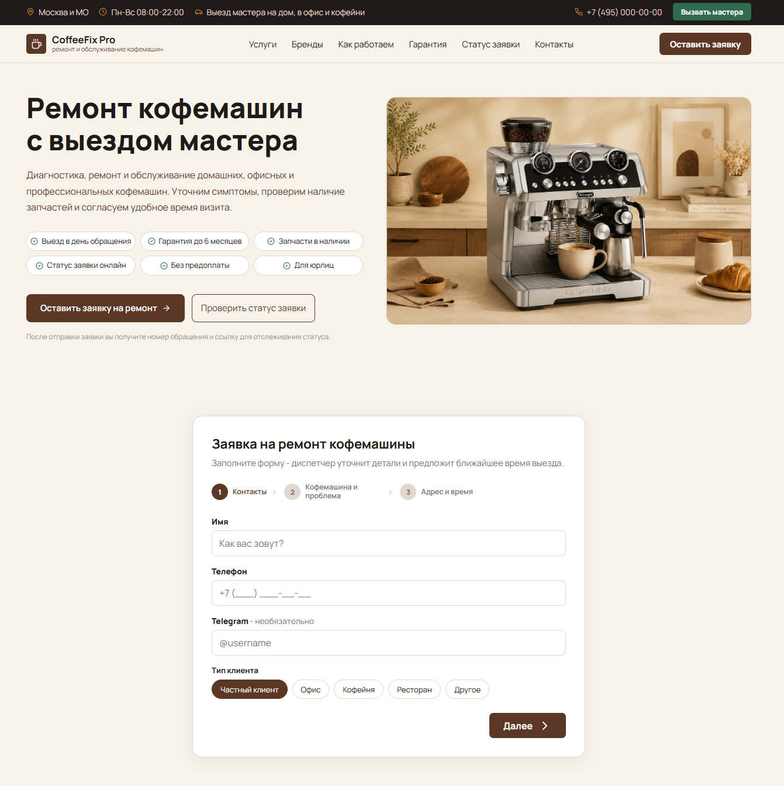
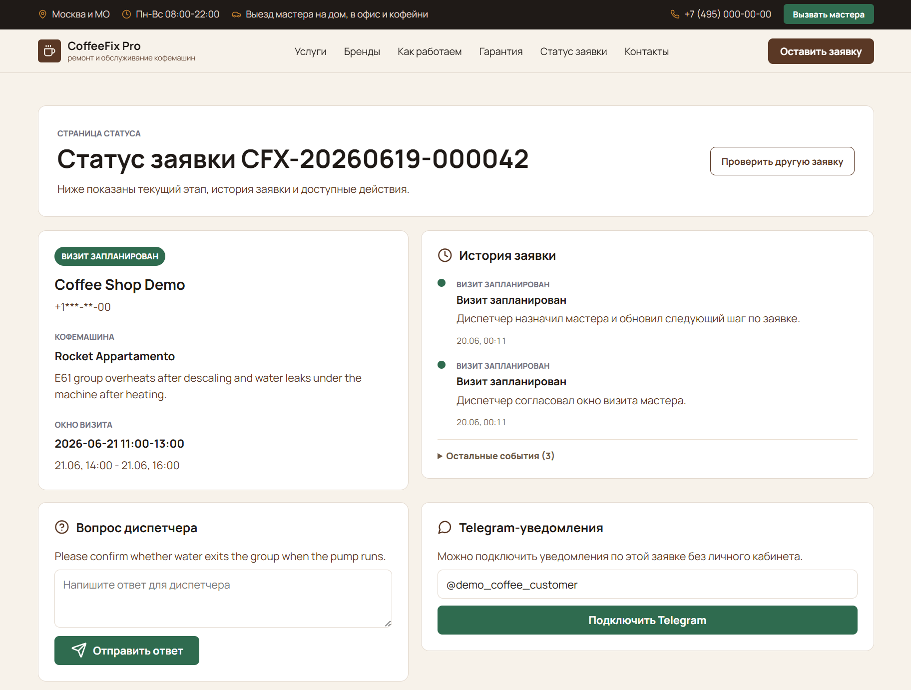
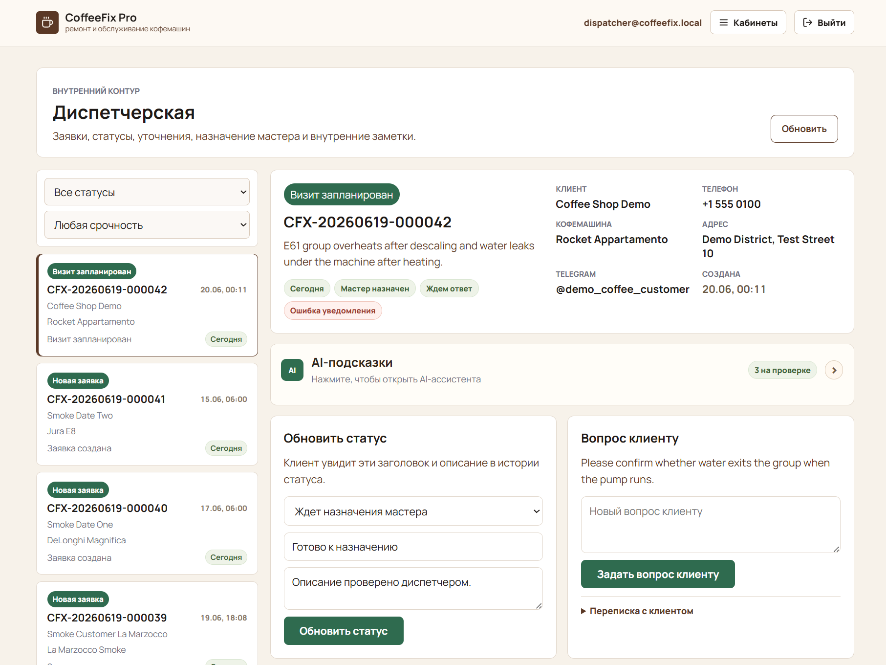
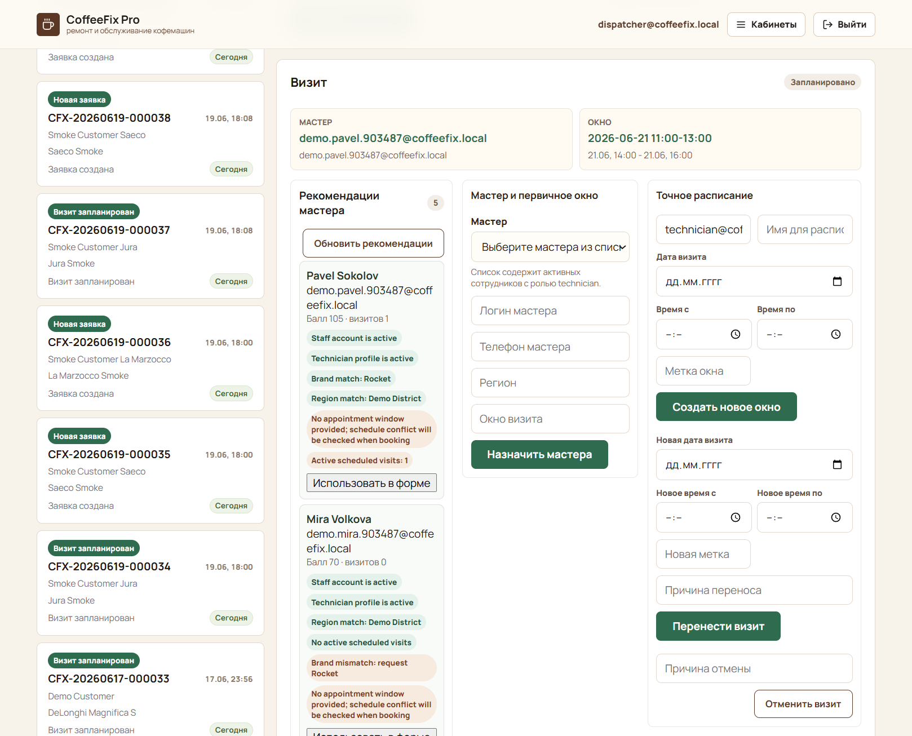
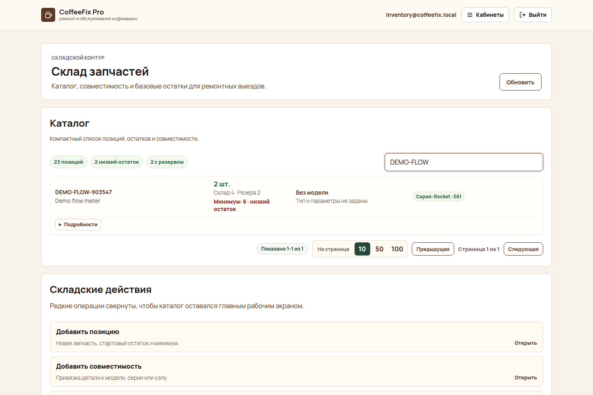
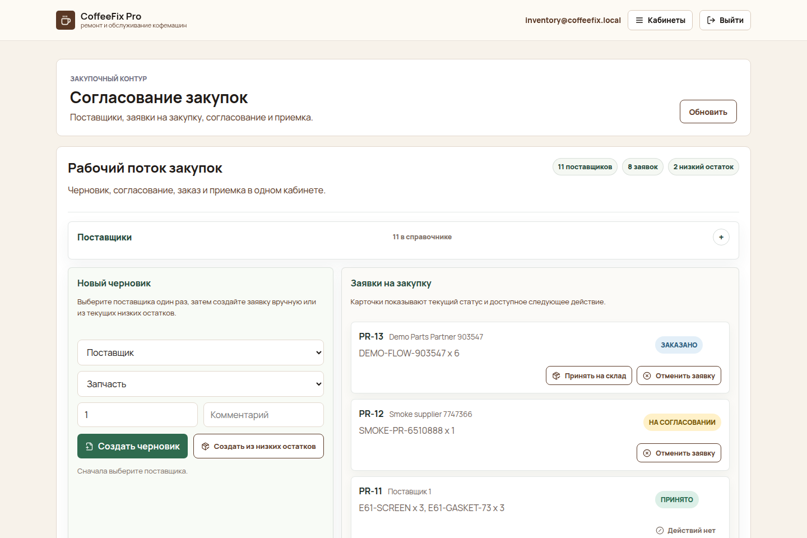
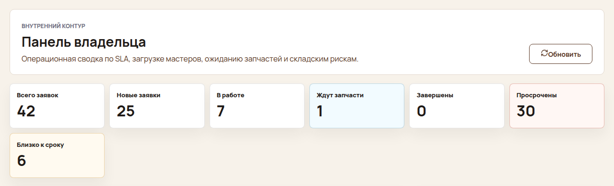
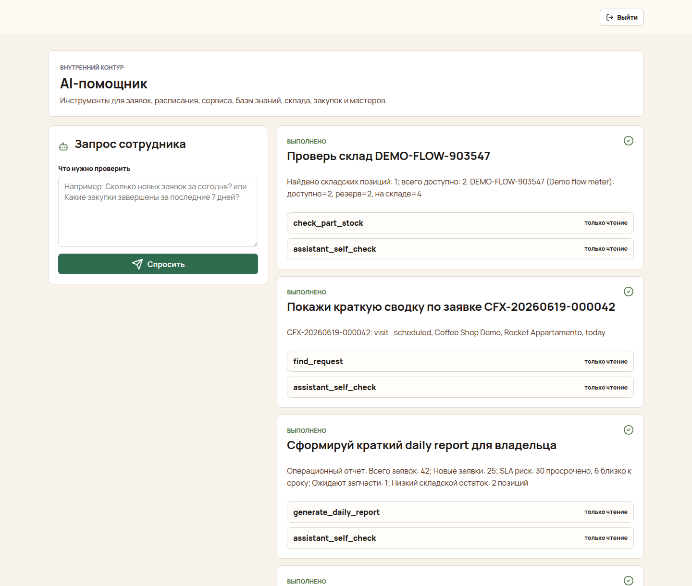
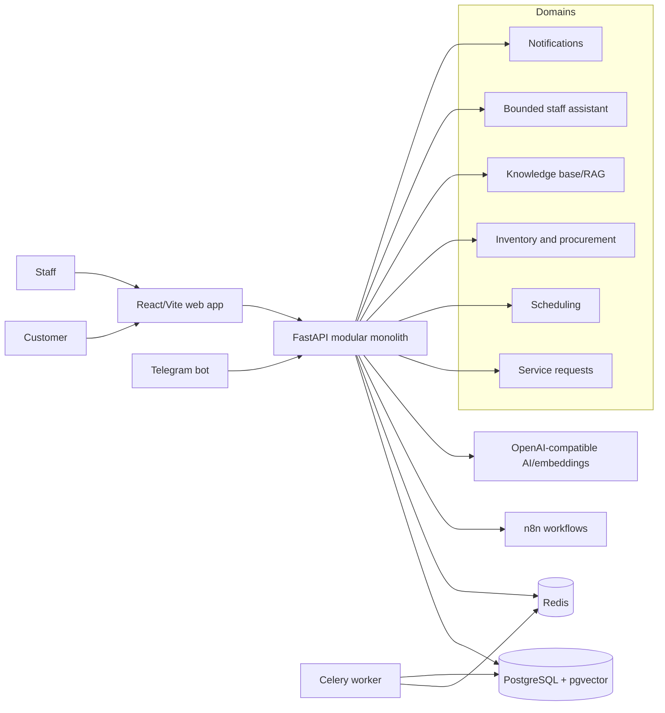

# Coffee Fix ServiceOps

Coffee Fix ServiceOps is an AI-assisted operations system for coffee machine repair teams. It shows how a repair business can move from a public request form to dispatcher triage, technician work, inventory reservations, customer status tracking, Telegram notifications, n8n automation, and production-ready deployment evidence.

## Live Demo

- Public web demo: [https://coffeefix-demo.online](https://coffeefix-demo.online)
- Public API health: [https://api.coffeefix-demo.online/health](https://api.coffeefix-demo.online/health)
- Demo guide: [docs/product/portfolio-demo-guide.md](docs/product/portfolio-demo-guide.md)

The public site can be reviewed without staff access. Internal workspaces are protected by role-based staff login. Demo staff credentials are not committed to the repository; they should be disposable accounts created by the operator for a specific review window.

## What To Review First

If you have only a few minutes, start with the visual walkthrough:

1. Scan the screenshots below to see the public intake, staff operations, inventory, procurement, owner view, and AI assistant.
2. Review the bounded AI/RAG flow in the dispatcher screenshot, then compare it with the assistant screen.
3. Check the architecture diagram to see how the React app, FastAPI API, PostgreSQL/pgvector, Redis, worker, Telegram bot, and n8n fit together.
4. For a live review, follow the safe data rules in [docs/product/portfolio-demo-guide.md](docs/product/portfolio-demo-guide.md).

Recommended demo route: public intake -> public status -> dispatcher triage -> AI suggestions/RAG -> technician recommendations -> inventory reservations -> procurement -> owner dashboard -> staff AI assistant.

## Product Screenshots

| Public landing | Public-safe status |
| --- | --- |
|  |  |

| Dispatcher AI triage | Technician recommendations |
| --- | --- |
|  |  |

| Inventory reservations | Procurement workflow |
| --- | --- |
|  |  |

| Owner dashboard | Staff AI assistant |
| --- | --- |
|  |  |

## What It Demonstrates

The project packages a realistic service-operations workflow:

- customers submit repair requests and receive request numbers;
- customers can check a public-safe status page and answer clarification questions;
- dispatchers triage requests, change statuses, ask questions, assign technicians, schedule visits, and review notification delivery;
- AI generates staff-reviewed suggestions using a source-backed RAG knowledge base;
- technicians see assigned visits, record diagnosis, repair results, and parts used;
- inventory staff maintain parts, stock, compatibility, reservations, movement history, and low-stock visibility;
- owners/admins can review SLA risk, workload, low-stock risk, and daily report data;
- inventory/admin staff can manage lightweight supplier and purchase-request workflows;
- dispatchers can use deterministic technician recommendations with reasons and risks;
- authorized staff can use a bounded AI assistant that runs safe tools and requires confirmation for purchase-draft creation;
- n8n and Telegram deliver operational notifications while the API remains the source of truth;
- production deployment uses Docker Compose, Dokploy/VPS routing, PostgreSQL, Redis, n8n, backups, smoke checks, and sanitized evidence.

## Core Workflows

1. **Public intake:** a customer submits name, phone, client type, machine brand/model, problem, address or district, urgency, and optional Telegram handle.
2. **Public status:** the request gets a `CFX-YYYYMMDD-000001` style number and a public status snapshot that hides internal notes, AI internals, staff data, inventory data, and audit details.
3. **Dispatcher triage:** staff can update lifecycle status, request clarification, add internal notes, assign a technician, and create or adjust structured appointment windows.
4. **AI suggestions:** dispatcher-reviewed suggestions can classify intake, propose diagnostic questions, likely causes, parts hints, and customer reply drafts. AI never changes status, assigns technicians, reserves parts, or sends customer messages without staff action.
5. **Technician workflow:** technicians can work assigned visits from a protected workspace and record diagnosis, repair result, and parts used.
6. **Inventory workflow:** inventory staff can manage catalog identity, stock, compatibility rows, request-linked reservations, releases, movements, and low-stock visibility.
7. **Procurement lite:** inventory/admin staff can draft, approve, order, receive, or cancel simple internal purchase requests while stock movements remain auditable.
8. **Owner visibility:** admins can review SLA risk, workload, waiting-for-parts, technician workload, top issue groups, low-stock risk, and daily report payloads.
9. **Staff AI assistant:** authorized staff can ask for request lookup, overdue work, knowledge search, stock checks, technician recommendations, daily reports, and confirmed purchase-draft creation.
10. **Notification automation:** backend events go to self-hosted n8n workflows, which send Telegram messages and call the API back with delivery results.

## Architecture

The system is a modular monolith with DDD and hexagonal boundaries. The repository keeps product intent, domain maps, execution plans, review artifacts, and operations evidence close to the code so future work can continue without chat history.



Main applications:

- `apps/api`: FastAPI REST API, domain use cases, migrations, and production operation commands.
- `apps/web`: React/Vite public site plus dispatcher, technician, inventory, and admin workspaces.
- `apps/worker`: Celery worker boundary for background jobs.
- `apps/telegram-bot`: aiogram bot for Telegram opt-in token linking.
- `docker-compose.production.yml`: production-oriented Compose runtime for API, web, worker, Telegram bot, PostgreSQL, Redis, and self-hosted n8n.

Start with [ARCHITECTURE.md](ARCHITECTURE.md), then [docs/execution-plans/index.md](docs/execution-plans/index.md) for the current phase map.

## AI, RAG, And Automation

AI is intentionally bounded. The system supports deterministic local/test providers and configurable OpenAI-compatible live adapters, but suggestions stay staff-reviewed. Prompt assembly excludes phone numbers, Telegram handles, secrets, provider payloads, internal notes, and unrestricted source text.

The RAG layer stores curated coffee-machine repair knowledge with source metadata and filters weakly related chunks before provider calls. If no relevant source remains, the AI path treats the request as a knowledge gap instead of forcing an unrelated repair scenario.

n8n automates delivery around backend events only. It validates shared webhook secrets, sends Telegram messages, and writes delivery outcomes back to the API. It does not own request lifecycle state, staff identity, customer answers, inventory counts, or repair decisions.

Deeper docs:

- [docs/operations/ai-providers.md](docs/operations/ai-providers.md)
- [docs/operations/n8n-workflows.md](docs/operations/n8n-workflows.md)
- [docs/operations/self-hosted-n8n-vps-evidence-2026-06-16.md](docs/operations/self-hosted-n8n-vps-evidence-2026-06-16.md)

## Demo Safety

Portfolio review should use fake customers, fake phone numbers, fake addresses, and disposable staff accounts. Do not publish reusable admin credentials, real Telegram chat ids, bot tokens, API keys, webhook secrets, raw provider payloads, customer phone numbers, or staff personal data.

This repository does not add a production database reset command for the portfolio demo. Resetting demo data is only safe in a separate disposable environment. For the current public demo, create fresh fake requests and deactivate or rotate disposable staff accounts when a review window ends.

See the full policy and walkthrough in [docs/product/portfolio-demo-guide.md](docs/product/portfolio-demo-guide.md).

## Local Development

Run the public web app:

```bash
npm run web:dev
```

Common verification commands:

```bash
python3 tools/repo-checks/check_docs.py
npm run web:test
npm run web:lint
npm run web:build
cd apps/api && uv run --extra dev pytest
cd apps/worker && uv run --extra dev pytest
cd apps/telegram-bot && uv run --extra dev pytest
```

Local Docker Compose binds PostgreSQL, Redis, API, and web to localhost-only ports. Production deployment uses `docker-compose.production.yml` and should keep PostgreSQL, Redis, and direct n8n ports private.

## Production And Operations Evidence

The public demo has sanitized evidence for HTTPS routing, direct-port posture, Dokploy access restriction, smoke checks, n8n/Telegram delivery, backup readiness, and hero image optimization:

- [docs/operations/public-demo-launch-evidence.md](docs/operations/public-demo-launch-evidence.md)
- [docs/operations/deployment-runbook.md](docs/operations/deployment-runbook.md)
- [docs/operations/smoke-tests.md](docs/operations/smoke-tests.md)
- [docs/operations/backup-restore.md](docs/operations/backup-restore.md)
- [docs/operations/operational-diagnostics.md](docs/operations/operational-diagnostics.md)
- [docs/operations/incident-response.md](docs/operations/incident-response.md)

## Roadmap

Completed slices include public intake/status, staff RBAC, dispatcher workflow, AI/RAG suggestions, technician workflow, inventory reservations, scheduling depth, notification automation, production deployment artifacts, public demo closure, portfolio packaging, frontend workspace decomposition, owner dashboard/SLA foundation, operational n8n automation, procurement lite, technician recommendation lite, and a bounded staff AI assistant with tools.

The post-Phase-16 roadmap is complete through Phase 24. Any next slice should be deliberately scoped from the current codebase rather than inferred from the historical roadmap. Known follow-up candidates are:

- assistant RBAC/audit polish;
- role-aware assistant examples;
- confirming-staff attribution in procurement artifacts;
- stricter internal-origin allowlisting for assistant links.

See [docs/execution-plans/index.md](docs/execution-plans/index.md) for current planning status and [docs/execution-plans/roadmap-after-phase-16.md](docs/execution-plans/roadmap-after-phase-16.md) for historical ordering rationale.

## Skills Demonstrated

- Product and domain modeling for service operations.
- DDD/hexagonal modular-monolith architecture.
- FastAPI, React/Vite, PostgreSQL, Redis, Celery, Docker Compose, and Dokploy/VPS operations.
- RAG retrieval, deterministic AI testing, OpenAI-compatible provider boundaries, and safe prompt assembly.
- Human-in-the-loop AI workflow design.
- n8n workflow automation with callback persistence.
- Telegram opt-in and notification delivery contracts.
- Production smoke tests, backup/restore procedures, structured logging, incident response, and sanitized evidence.
- Repository-guided development with execution plans, review gates, and durable project context.
